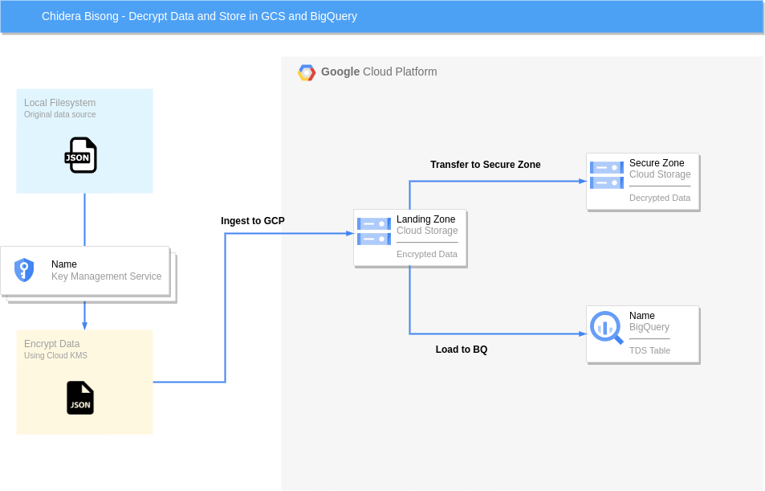

# TDS Interview

## Project Overview
In this project, we build a data pipeline that will encrypt a data file using secure AES symmetric encryption stored in Google Cloud Key Management Service (KMS). This encrypted data file is then ingested into a landing zone in Google Cloud Storage. The file is then decrypted using Cloud KMS and stored in Cloud Storage as well as ingested into a BigQuery table.

Finally, this pipeline is wrapped in an AirFlow DAG that can be executed on Google Cloud Composer.

## Google Cloud Components
This project used the following Google Cloud components:
- Google Cloud Key Management Service (KMS) API
- Google Cloud Storage.
- Google Cloud BigQuery.
- Google Cloud Composer.
- Google Cloud IAM.

## Solution Architecture

The solution architecture follows the following steps.
1. We create a symmetric key stored on Google Cloud KMS that will be responsible for encrypting the data on our local file service and decrypting the data on the GCS landing zone.
2. The original JSON data file is encrypted locally. This encrypted file is transferred to the landing zone on Google Cloud Storage.
3. We then decrypt the data on the GCS landing zone and store the decrypted JSON file in a secure GCS bucket (the secured zone).
4. The decrypted JSON file is then loaded into a BigQuery table.
